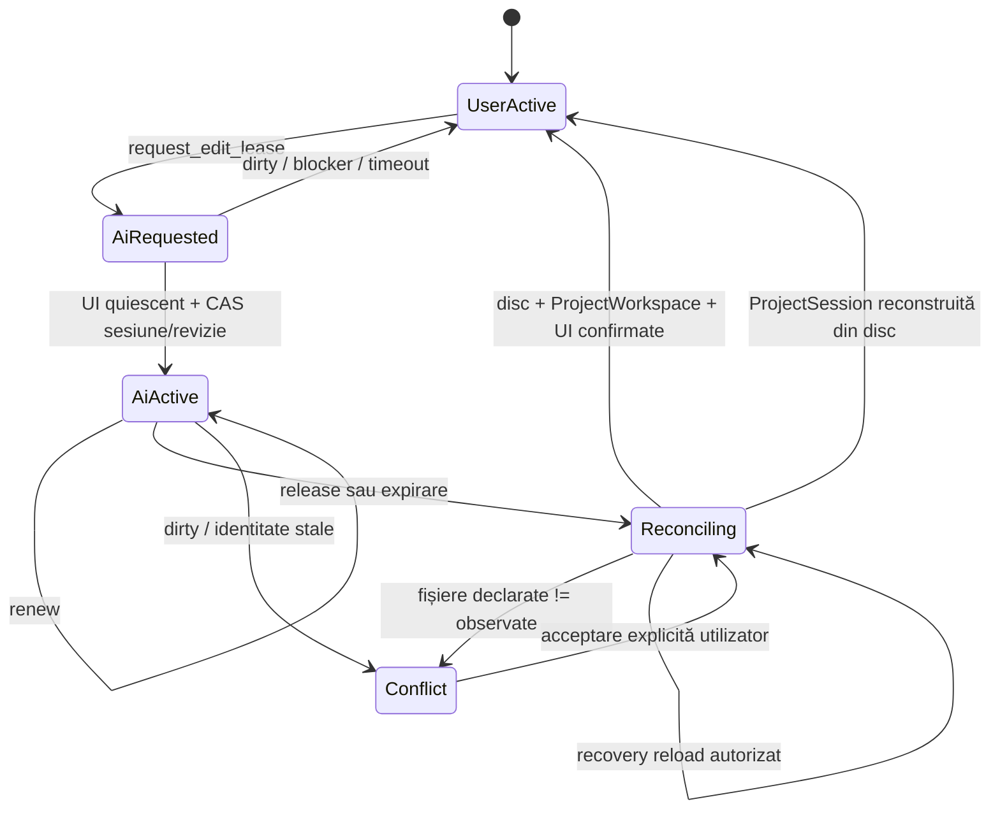

# Audit MCP și coordonare AI — arhitectură Rust-first

Data auditului: 18 iulie 2026

## Verdict

Subsistemul MCP a fost refăcut ca un Context Hub autentificat, read-only pentru
datele proiectului, cu un protocol single-writer controlat de nucleul Rust.
MCP nu scrie sursele. Singurele mutații expuse prin MCP sunt operațiile de
coordonare în RAM `request_edit_lease`, `renew_edit_lease` și
`release_edit_lease`.

Autoritatea efectivă nu depinde de indicatorul frontend. Toate mutațiile de
sursă, Project Transition și reconcilierea externă sunt validate în Rust.
Frontendul este o proiecție și o barieră de interacțiune suplimentară.

Implementarea elimină conflictele silențioase dintre sesiunea din RAM și discul
modificat de AI. Un eșec de proiecție nu redă controlul utilizatorului: intră
în recovery explicit și păstrează sursele blocate.

## Domeniul auditat

- serverul MCP și integrarea Codex;
- starea canonică a aplicației publicată către AI;
- ProjectWorkspace, FileBuffer Store și AcceptedDisk;
- toate porțile de mutație a surselor și Project Transition;
- dirty state, drafturi, cozi de mutații și quiescence UI;
- monitorizarea și reconcilierea schimbărilor externe;
- ciclul request/grant/renew/release/expire/conflict/recovery;
- securitatea transportului local și persistența descriptorilor;
- integrarea frontend și indicatorul de autoritate;
- packaging-ul template-ului de proiect.

## Constatări remediate

1. Serverul JSON-RPC/HTTP manual a fost înlocuit cu `rmcp` 2.2.0 și transport
   Streamable HTTP standard.
2. Contextul canonic nu mai este scris pe disc. `current-context.json` și
   `mcp.json` sunt descriptori de diagnostic neautoritativi și nu conțin root-ul
   proiectului, selecția, textul UI sau tokenul.
3. Accesul MCP local neautentificat a fost înlocuit cu un token capability de
   256 biți, generat din randomness-ul sistemului de operare și verificat
   constant-time.
4. Configurarea Codex respectă `CODEX_HOME`, păstrează configurația străină și
   refuză fișiere TOML invalide, oversized, symlink-uri și permisiuni nesigure.
5. Lipsea o autoritate comună între editor și AI. Aceasta este acum starea
   `EditAuthority` deținută exclusiv de Rust.
6. Dirty state-ul din RAM putea fi ignorat de un editor extern. Grant-ul cere
   acum ProjectWorkspace clean, recovery clean, identitate exactă de sesiune și
   revizie, apoi ACK de quiescence din frontend.
7. Reconcilierea putea atribui AI-ului un set de fișiere diferit de cel
   modificat efectiv. Release-ul compară setul declarat cu manifestul observat
   de Rust; orice diferență intră în `Conflict`.
8. Detectarea externă acoperă acum întreg manifestul proiectului, inclusiv
   fișiere noi, șterse sau anterior netrackuite, nu doar bufferele încărcate.
9. Un lease expirat putea depinde de polling-ul frontend. Expirarea este
   evaluată în Rust înaintea fiecărei operații și un lease expirat nu poate fi
   reînviat prin renew.
10. TTL-ul inițial de 30 de secunde era nepractic pentru CLI. TTL-ul este acum
    120 de secunde, cu renew necesar pentru lucrări mai lungi.
11. Un eșec Preview putea lăsa reconcilierea deschisă nelimitat. Faza de
    proiecție externă are acum deadline global de 30 de secunde și intră
    fail-safe în recovery.
12. Butonul de recovery era blocat de propriul gate `Reconciling`. Rust poate
    autoriza acum strict un recovery reload, fără a permite mutații de sursă.
13. Context Hub putea rămâne la revizia veche după ce Rust accepta discul.
    Receipt-ul external reconcile este legat imediat de un snapshot
    ProjectWorkspace exact înainte de proiecția Preview.
14. Indicatorul putea deveni verde cât timp UI era în recovery. Semaforul ia
    acum în calcul și reconcilierea externă, și recovery-ul proiecției.
15. Template-ul de proiect era căutat la runtime, dar nu era inclus în bundle.
    Resursa este acum declarată explicit în configurația Tauri.

## Arhitectura rezultată

### 1. Nucleul Rust

`kernel/ai_coordination` deține state machine-ul, clienții MCP, revizia de
coordonare, TTL-ul și toate gate-urile. `WriteAuthority` și comenzile de proiect
apelează gate-urile Rust înaintea oricărui efect persistent.

### 2. Context Hub

Frontendul publică numai o proiecție UI tipizată. Rust o validează prin CAS
față de `runtimeSessionId` și `ProjectWorkspace.revision`, apoi completează
snapshotul cu adevărul canonic din ProjectWorkspace și coordonare.

### 3. MCP

MCP expune:

- resursa `panastudio://context/current`;
- `get_current_context`, read-only;
- `request_edit_lease`, coordonare RAM;
- `renew_edit_lease`, coordonare RAM;
- `release_edit_lease`, coordonare RAM.

Nu există unealtă MCP pentru scrierea fișierelor proiectului.

### 4. Frontend

Controllerul de coordonare face polling la 500 ms, drenează drafturile și
cozile tranzitorii, suspendă monitorul extern înainte de grant și aplică
`inert` zonelor de editare cât timp AI deține sau reconciliază autoritatea.
Terminalul și navigarea read-only rămân disponibile.

### 5. Reconciliere externă

După release, Rust compară manifestul curent cu AcceptedDisk. Frontendul
proiectează receipt-ul Rust în source cache, Source Graph, SCSS și Preview.
Controlul utilizatorului revine doar după confirmarea aceleiași sesiuni,
aceleiași revizii și aceluiași set de fișiere.

## Invariabile de siguranță

- Cel mult o sesiune AI poate deține un lease.
- AI nu primește lease dacă proiectul este închis, dirty, stale sau recovery nu
  este clean.
- `AiRequested` este rezervare în două faze; grant-ul apare numai după
  quiescence și revalidare.
- UI nu este autoritatea finală. Ocolirea `inert` nu ocolește gate-ul Rust.
- AI scrie numai prin filesystem și numai după status `granted`.
- Release-ul nu redă direct autoritatea utilizatorului; intră în
  `Reconciling`.
- Fișierele declarate de AI trebuie să fie identice cu cele observate de Rust.
- Un lease expirat intră în reconciliere, nu în unlock direct.
- O proiecție UI eșuată păstrează editarea și Save blocate.
- Recovery reload poate schimba ProjectSession, dar nu poate permite mutații
  de sursă în vechea sesiune.

## Workflow obligatoriu pentru AI

1. Citește `get_current_context`.
2. Verifică `project.isOpen`, identitatea sesiunii, `projectRevision`,
   `dirtyState` și `externalDisk`.
3. Dacă sesiunea este dirty, cere utilizatorului Save sau Discard. Nu edita.
4. Apelează `request_edit_lease` cu sesiunea, revizia, un `requestId` stabil și
   intenția.
5. Repetă idempotent cererea până primește `granted`; nu interpreta
   `pending_ui_quiescence` ca permisiune de scriere.
6. Modifică exclusiv fișierele sursă prin filesystem.
7. Reînnoiește lease-ul înainte de 120 de secunde.
8. Apelează `release_edit_lease` cu lista exactă a fișierelor schimbate.
9. Așteaptă `user_active`. Dacă apare `conflict` sau
   `workspaceProjectionRecoveryRequired`, explică utilizatorului acțiunea
   necesară și nu mai scrie.

## Securitatea transportului

- bind exclusiv pe `127.0.0.1:48731`;
- Host allowlist și Origin allowlist exactă;
- antet capability `X-Pana-Studio-Token` pe health, MCP și resurse;
- token URL-safe de 256 biți, comparație constant-time;
- limită body 256 KiB;
- configurația care conține tokenul trebuie să aibă permisiuni private
  (`0600` pe Unix);
- tokenul nu este returnat în status, loguri sau descriptorii aplicației;
- identificarea clientului MCP este server-side, nu controlată prin argumentele
  uneltelor;
- tool annotations declară clar read-only, idempotence și open-world behavior.

## Validare efectuată

- teste unitare pentru grant, dirty gate, multi-client, expirare, renew,
  mismatch de manifest, conflict, acceptare umană și recovery reload;
- suită Rust completă: 924 teste trecute, 0 eșuate, 1 ignorat;
- `svelte-check` fără erori și fără warnings;
- handshake MCP 2025-11-25, listare tools/resources și citire resursă;
- auth corect/greșit, Host și Origin nepermise;
- test live cu proiect izolat: grant, blocare UI, modificare reală de fișier,
  release, manifest observat identic, reconciliere și conflict recovery;
- test live al deadline-ului Preview și al recovery reload-ului protejat;
- verificare că Context Hub publică revizia Rust nouă și starea de recovery.

## Riscuri și limitări rămase

### P1 — Preview `styledReady`

Proiectul Zola minimal folosit în test a produs repetat timeout-ul
`Canvas-ul navigat nu a confirmat styledReady în 15 secunde`. Problema este în
pipeline-ul Preview/Canvas, nu în protocolul MCP. Acum este bounded și fail-safe:
discul rămâne canonic, sursele sunt blocate și utilizatorul primește recovery
explicit. Cauza bridge-ului Preview trebuie auditată separat.

### P1 — CSP WebView

`tauri.conf.json` are încă `app.security.csp: null`. Tokenul MCP nu este expus
WebView-ului, dar un XSS în aplicație ar putea folosi comenzile Tauri permise.
Este recomandat un audit CSP și o allowlist minimă compatibilă cu Preview și
Vite production.

### Granița de securitate a sistemului de operare

Lease-ul este o garanție cooperativă între Pană Studio și clienții AI care
respectă MCP. Niciun lock user-space nu poate opri un proces arbitrar al
aceluiași utilizator Unix să scrie direct fișierele. Același utilizator poate
citi și configurația Codex care conține tokenul. Pentru izolare adversarială ar
fi necesare conturi, sandbox-uri sau permisiuni OS distincte.

### Oprire forțată

Un `SIGKILL` nu poate scrie un tombstone de shutdown. Descriptorii persistenți
sunt declarați neautoritativi; clienții trebuie să confirme endpointul live și
Context Hub-ul autentificat.

### Port fix

Portul 48731 este intenționat stabil pentru configurația Codex. O a doua
instanță eșuează închis la bind; nu preia un server străin doar pentru că portul
este ocupat.

## Pașii recomandați următori

1. Audit separat al handshake-ului Canvas `styledReady` și al cozilor Preview
   care pot înlocui tranzacții în timpul recovery reload.
2. CSP production strict pentru WebView și inventarierea completă a
   capabilităților Tauri.
3. Test end-to-end automatizat pentru MCP + UI quiescence + filesystem edit +
   recovery, rulat fără HMR.
4. Mutarea monitorizării externe de la polling la watcher Rust nativ, păstrând
   manifestul și gate-urile actuale drept sursă de adevăr.
5. Opțional, un marker/lock cooperativ de proiect pentru alte CLI-uri locale;
   acesta trebuie tratat ca semnal, nu ca izolare OS.
